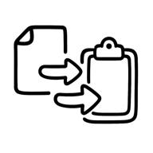

# copipable


A temporary copy-and-paste sticky-note web application (PWA-enabled) with native app support via Electron.

## Features
- Create, edit, delete, and copy text notes
- Save image notes via clipboard paste or drag-and-drop
- Move notes freely like sticky notes
- Display a badge with the current note count
- Toggle dark/light mode (Bootstrap 5 data-bs-theme)
- PWA support with Web App Manifest for home screen installation
- Double-click image notes to view them in an enlarged modal
- In the native app, instantly copy a note by its number using a global keyboard shortcut

## Installation
1. Clone this repository or download the ZIP
2. Ensure `icons/`, `index.html`, `style.css`, `script.js`, `manifest.json`, `LICENSE`, and `README.md` are in the same directory
3. Serve the directory with an HTTP server (e.g., `python3 -m http.server`)
4. Open `http://localhost:8000` in your browser

> **Note:** PWA features require HTTPS or `localhost` to be enabled

## Usage
1. Enter text in the textarea and click **Save** to create a text note
2. Paste images from the clipboard or drag-and-drop them into the textarea to create image notes
3. Double-click a note: edit text notes or view image notes in an enlarged modal
4. Drag the note header to reposition notes anywhere on the workspace
5. Click the copy icon to copy note content (text or image) to the clipboard
6. Click the trash icon on a note to delete it, or use the **Clear All** button to remove all notes
7. Toggle dark/light mode using the switch in the navbar
8. Notes and their positions are stored in IndexedDB and persist after reloads

## Desktop Application via Electron

For environment setup with Electron Forge, see: https://www.electronforge.io/import-existing-project

Prerequisites:
- Node.js (v14+)

Steps:
```bash
# 1. Install dependencies
npm install

# 2. Run in development mode
npm start

# 3. Create a packaged app (out/package)
npm run package

# 4. Make distributables (Zip, DMG) in out/make
npm run make
```

Icons:
- The app icon is set via `icons/icon.icns` (specified in `forge.config.js`).

Global shortcuts:
- Windows/Linux: Press `Ctrl + <key ID>` to copy the corresponding note to the clipboard.
- macOS: Press `⌘ + <key ID>` to copy the corresponding note to the clipboard.

## License
This project is licensed under the MIT License. See `LICENSE` for details.
